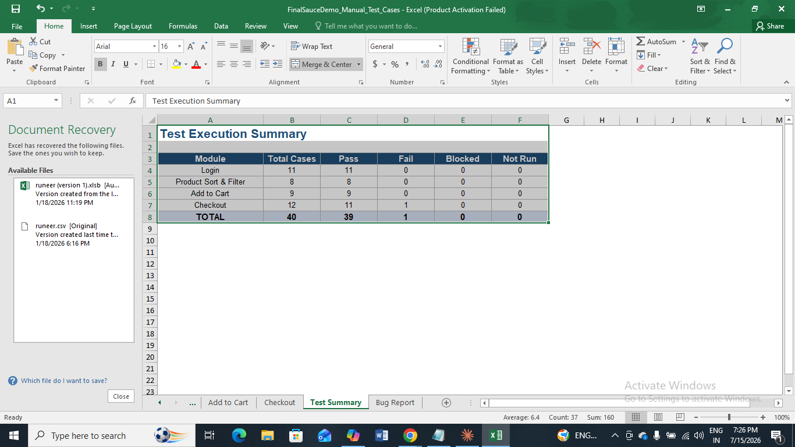
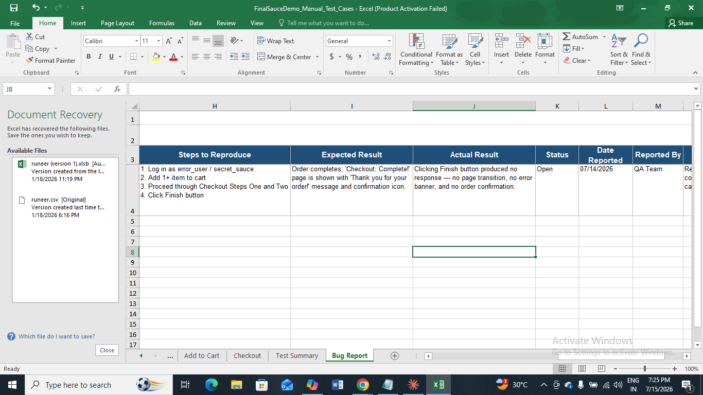

# SauceDemo Manual Testing Project

This repository contains a complete manual testing project for the [SauceDemo](https://www.saucedemo.com) e-commerce demo site.  
It covers end-to-end functional testing: **Login → Product Browsing/Sort & Filter → Add to Cart → Checkout → Order Confirmation**.

---

## 📌 Scope

**In Scope**
- Login scenarios (valid/invalid users, special test accounts)
- Product catalog display and sorting
- Add to Cart functionality
- Checkout flow (field validation, order overview, order completion)

**Out of Scope**
- Performance/load testing
- Security/penetration testing
- API testing
- Accessibility audit

---

## 🎯 Test Objectives
1. Verify login scenarios and special test users behave as documented.  
2. Validate inventory listing, sorting, and product detail accuracy.  
3. Confirm items can be added/removed from cart and cart state persists correctly.  
4. Validate checkout flow, field validation, and order completion.  

---

## 🧪 Test Data (Login Users)
- `standard_user` → normal, fully functional  
- `locked_out_user` → blocked login with error  
- `problem_user` → UI/image glitches  
- `performance_glitch_user` → valid login with delay  
- `error_user` → triggers checkout defect  
- `visual_user` → used for visual/layout regression  

---

## 📂 Deliverables
- **Excel Workbook**: `FinalSauceDemo_Manual_Test_Cases_1.xlsx`  
  - Login module (11 cases)  
  - Product Sort & Filter module (8 cases)  
  - Add to Cart module (9 cases)  
  - Checkout module (12 cases)  
- **Bug Report Tab**: Documented defect (BUG‑CHK‑11: Finish button unresponsive for `error_user`)  
- **Test Summary Tab**: Execution results (39 Pass, 1 Fail, 0 Blocked, 0 Not Run)  

---

## 🖥️ Test Environment
- Application: [SauceDemo](https://www.saucedemo.com)  
- Browsers: Chrome (latest), Firefox (latest)  
- OS: Windows 10  

---

## 📊 Test Execution Summary

| Module               | Total Cases | Pass | Fail | Blocked | Not Run |
|----------------------|-------------|------|------|---------|---------|
| Login                | 11          | 11   | 0    | 0       | 0       |
| Product Sort & Filter| 8           | 8    | 0    | 0       | 0       |
| Add to Cart          | 9           | 9    | 0    | 0       | 0       |
| Checkout             | 12          | 11   | 1    | 0       | 0       |
| **TOTAL**            | **40**      | **39** | **1** | **0** | **0** |

---

## 📖 How to Use
1. Open the Excel workbook.  
2. Navigate to each module tab (Login, Product Sort & Filter, Add to Cart, Checkout).  
3. Review test cases, Actual Results, and Status.  
4. Check the Bug Report tab for documented defects.  
5. Refer to the Test Summary tab for overall execution results.

   ## 📊 Test Summary (Screenshot)
Here’s a visual snapshot of the Test Summary tab:

---

## 🐞 Bug Report Example
Here’s the Bug Report tab showing BUG‑CHK‑11:

---

## ✅ Key Highlight
- Demonstrates **manual QA skills**: test design, execution, defect logging, and reporting.  
- Includes both **Pass cases** and a **Fail case with Bug Report** for realism.  
- Portfolio‑ready for showcasing on GitHub or freelance platforms.  
